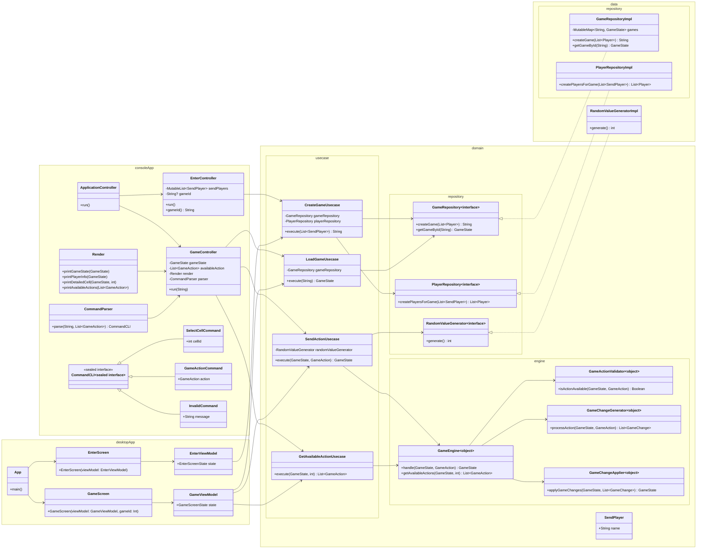

# Разделение по слоям

```mermaid
classDiagram
    direction LR

    namespace data.repository {
        class GameRepositoryImpl {
            -MutableMap~String, GameState~ games
            +createGame(List~Player~) String
            +getGameById(String) GameState
        }
        class PlayerRepositoryImpl {
            +createPlayersForGame(List~SendPlayer~) List~Player~
        }
    }

    namespace data {
        class RandomValueGeneratorImpl {
            +generate() int 
        } 
    }

    namespace consoleApp {
        class ApplicationController {
            +run()
        }
        class EnterController {
            -MutableList~SendPlayer~ sendPlayers
            -String? gameId
            +run()
            +gameId() String
        }
        class GameController {
            -GameState gameState
            -List~GameAction~ availableAction
            -Render render
            -CommandParser parser
            +run(String)
        }
        class CommandParser {
            +parse(String, List~GameAction~) CommandCLI
        }
        class CommandCLI~sealed interface~ {
            <<sealed interface>>
        }
        class SelectCellCommand {
            +int cellId
        }
        class GameActionCommand {
            +GameAction action
        }
        class InvalidCommand {
            +String message
        }
        class Render {
            +printGameState(GameState)
            +printPlayerInfo(GameState)
            +printDetailedCell(GameState, int)
            +printAvailableActions(List~GameAction~)
        }
    }

    namespace desktopApp {
        class App {
            +main()
        }
        class EnterScreen {
            +EnterScreen(viewModel: EnterViewModel)
        }
        class EnterViewModel {
            +EnterScreenState state
        }
        class GameScreen {
            +GameScreen(viewModel: GameViewModel, gameId: Int)
        }
        class GameViewModel {
            +GameScreenState state
        }
    }

    namespace domain.engine {
        class GameEngine ~object~ {
            +handle(GameState, GameAction) GameState
            +getAvailableActions(GameState, int) List~GameAction~
        }
        class GameActionValidator ~object~ {
            +isActionAvailable(GameState, GameAction) Boolean
        }
        class GameChangeGenerator ~object~ {
            +processAction(GameState, GameAction) List~GameChange~
        }
        class GameChangeApplier ~object~ {
            +applyGameChanges(GameState, List~GameChange~) GameState
        }
    }

    namespace domain.usecase {
        class CreateGameUsecase {
            -GameRepository gameRepository
            -PlayerRepository playerRepository
            +execute(List~SendPlayer~) String
        }
        class LoadGameUsecase {
            -GameRepository gameRepository
            +execute(String) GameState
        }
        class SendActionUsecase {
            -RandomValueGenerator randomValueGenerator
            +execute(GameState, GameAction) GameState
        }
        class GetAvailableActionUsecase {
            +execute(GameState, int) List~GameAction~
        } 
    }

    namespace domain {
        class SendPlayer {
            +String name
        }
    }

    namespace domain.repository {
        class GameRepository ~interface~ {
            +createGame(List~Player~) String
            +getGameById(String) GameState
        }
        class PlayerRepository ~interface~ {
            +createPlayersForGame(List~SendPlayer~) List~Player~
        }
        class RandomValueGenerator ~interface~ {
            +generate() int
        } 
    }

ApplicationController --> EnterController
ApplicationController --> GameController
Render --> GameController
CommandParser --> GameController 
CommandCLI <|-- SelectCellCommand
CommandCLI <|-- GameActionCommand
CommandCLI <|-- InvalidCommand
EnterController --> CreateGameUsecase
GameController --> LoadGameUsecase
GameController --> SendActionUsecase
GameController --> GetAvailableActionUsecase

App --> EnterScreen
App --> GameScreen
GameScreen --> GameViewModel
EnterScreen --> EnterViewModel
EnterViewModel --> CreateGameUsecase
GameViewModel --> LoadGameUsecase
GameViewModel --> SendActionUsecase
GameViewModel --> GetAvailableActionUsecase

CreateGameUsecase --> GameRepository
CreateGameUsecase --> PlayerRepository
LoadGameUsecase --> GameRepository
SendActionUsecase --> RandomValueGenerator
SendActionUsecase --> GameEngine
GetAvailableActionUsecase --> GameEngine
GameEngine --> GameActionValidator
GameEngine --> GameChangeGenerator
GameEngine --> GameChangeApplier

GameRepository <|.. GameRepositoryImpl
PlayerRepository <|.. PlayerRepositoryImpl
RandomValueGenerator <|.. RandomValueGeneratorImpl
```
