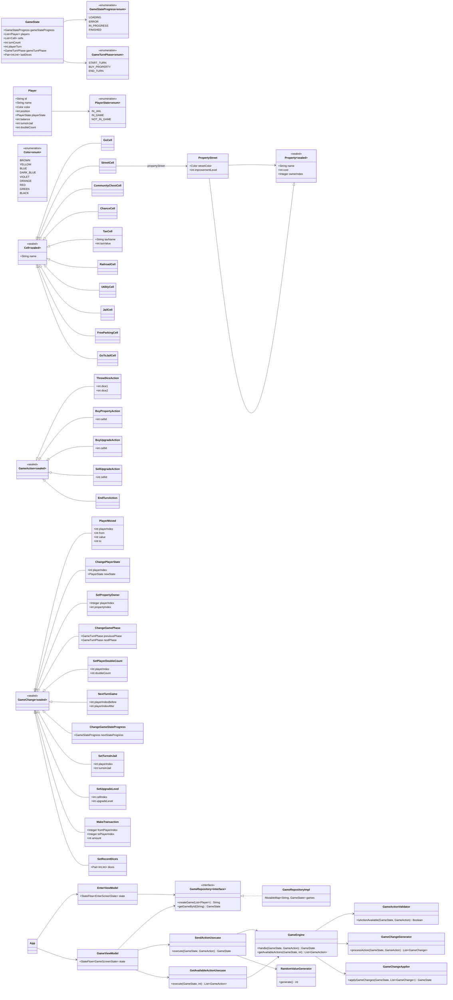

# Architecture Diagram

```mermaid
classDiagram
    direction LR
    class GameState {
        +GameStateProgress gameStateProgress
        +List~Player~ players
        +List~Cell~ cells
        +int turnCount
        +int playerTurn
        +GameTurnPhase gameTurnPhase
        +Pair~Int,Int~ lastDices
    }
    class GameTurnPhase~enum~ {
        <<enumeration>>
        START_TURN
        BUY_PROPERTY
        END_TURN
    }
    class GameStateProgress~enum~ {
        <<enumeration>>
        LOADING
        ERROR
        IN_PROGRESS
        FINISHED
    }


    class Player {
        +String id
        +String name
        +Color color
        +int position
        +PlayerState playerState
        +int balance
        +int turnsInJail
        +int doubleCount
    }
    class PlayerState~enum~ {
        <<enumeration>>
        IN_JAIL
        IN_GAME
        NOT_IN_GAME
    }
    class Color~enum~ {
        <<enumeration>>
        BROWN
        YELLOW
        BLUE
        DARK_BLUE
        VIOLET
        ORANGE
        RED
        GREEN
        BLACK
    }

    class Cell~sealed~ {
        <<sealed>>
        +String name
    }
    class GoCell
    class StreetCell
    class CommunityChestCell
    class ChanceCell
    class TaxCell {
        +String taxName
        +int taxValue
    }
    class RailroadCell
    class UtilityCell
    class JailCell
    class FreeParkingCell
    class GoToJailCell

    class Property~sealed~ {
        <<sealed>>
        +String name
        +int cost
        +Integer ownerIndex
    }
    class PropertyStreet {
        +Color streetColor
        +int improvementLevel
    }


    class GameAction~sealed~ {
        <<sealed>>
    }
    class ThrowDiceAction {
        +int dice1
        +int dice2
    }
    class BuyPropertyAction {
        +int cellId
    }
    class BuyUpgradeAction {
        +int cellId
    }
    class SellUpgradeAction {
        +int cellId
    }
    class EndTurnAction


    class GameChange~sealed~ {
        <<sealed>>
    }
    class PlayerMoved {
        +int playerIndex
        +int from
        +int value
        +int to
    }
    class ChangePlayerState {
        +int playerIndex
        +PlayerState newState
    }
    class SetPropertyOwner {
        +Integer playerIndex
        +int propertyIndex
    }
    class ChangeGamePhase {
        +GameTurnPhase previousPhase
        +GameTurnPhase nextPhase
    }
    class SetPlayerDoubleCount {
        +int playerIndex
        +int doubleCount
    }
    class NextTurnGame {
        +int playerIndexBefore
        +int playerIndexAfter
    }
    class ChangeGameStateProgress {
        +GameStateProgress nextStateProgress
    }
    class SetTurnsInJail {
        +int playerIndex
        +int turnsInJail
    }
    class SetUpgradeLevel {
        +int cellIndex
        +int upgradeLevel
    }
    class MakeTransaction {
        +Integer fromPlayerIndex
        +Integer toPlayerIndex
        +int amount
    }
    class SetRecentDices {
        +Pair~Int,Int~ dices
    }


    class GameEngine {
        +handle(GameState, GameAction) GameState
        +getAvailableActions(GameState, int) List~GameAction~
    }
    class GameActionValidator {
        +isActionAvailable(GameState, GameAction) Boolean
    }
    class GameChangeGenerator {
        +processAction(GameState, GameAction) List~GameChange~
    }
    class GameChangeApplier {
        +applyGameChanges(GameState, List~GameChange~) GameState
    }

    class GameRepository~interface~ {
        <<interface>>
        +createGame(List~Player~) String
        +getGameById(String) GameState
    }
    class GameRepositoryImpl {
        -MutableMap~String, GameState~ games
    }

    class SendActionUsecase {
        +execute(GameState, GameAction) GameState
    }
    class GetAvailableActionUsecase {
        +execute(GameState, int) List~GameAction~
    }
    class RandomValueGenerator {
        +generate() int
    }
    
    class EnterViewModel {
        +StateFlow~EnterScreenState~ state
    }
    class GameViewModel {
        +StateFlow~GameScreenState~ state
    }
    class App

    GameAction <|-- ThrowDiceAction
    GameAction <|-- BuyPropertyAction
    GameAction <|-- BuyUpgradeAction
    GameAction <|-- SellUpgradeAction
    GameAction <|-- EndTurnAction
    GameChange <|-- PlayerMoved
    GameChange <|-- ChangePlayerState
    GameChange <|-- SetPropertyOwner
    GameChange <|-- ChangeGamePhase
    GameChange <|-- SetPlayerDoubleCount
    GameChange <|-- NextTurnGame
    GameChange <|-- ChangeGameStateProgress
    GameChange <|-- SetTurnsInJail
    GameChange <|-- SetUpgradeLevel
    GameChange <|-- MakeTransaction
    GameChange <|-- SetRecentDices
    Cell <|-- GoCell
    Cell <|-- StreetCell
    Cell <|-- CommunityChestCell
    Cell <|-- ChanceCell
    Cell <|-- TaxCell
    Cell <|-- RailroadCell
    Cell <|-- UtilityCell
    Cell <|-- JailCell
    Cell <|-- FreeParkingCell
    Cell <|-- GoToJailCell
    Property <|-- PropertyStreet
    StreetCell --> PropertyStreet : propertyStreet
    GameEngine --> GameActionValidator
    GameEngine --> GameChangeGenerator
    GameEngine --> GameChangeApplier
    SendActionUsecase --> GameEngine
    SendActionUsecase --> RandomValueGenerator
    GetAvailableActionUsecase --> GameEngine
    GameRepository <|.. GameRepositoryImpl
    EnterViewModel --> GameRepository
    GameViewModel --> GameRepository
    GameViewModel --> SendActionUsecase
    GameViewModel --> GetAvailableActionUsecase
    GameState --> GameStateProgress
    GameState --> GameTurnPhase
    Player --> PlayerState
    App --> EnterViewModel
    App --> GameViewModel
    PropertyStreet --> Property
```
